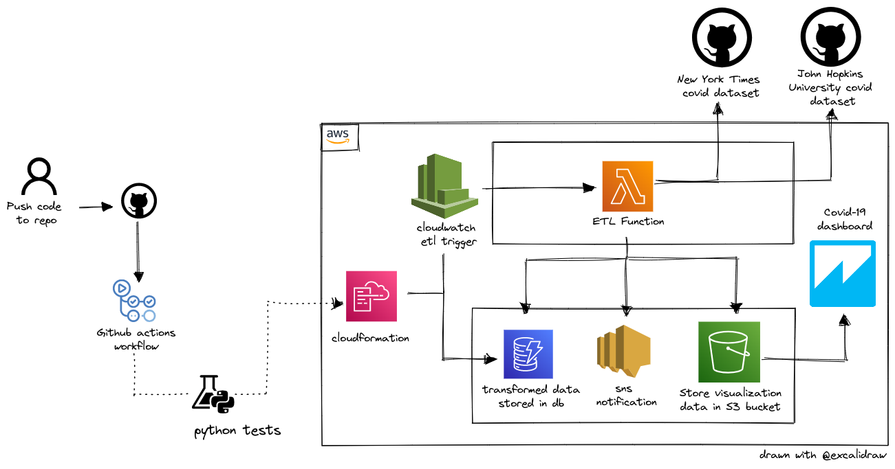

 

  <h3 align="center">#CloudGuruChallenge – Event-Driven Python on AWS</h3>
  

An automated ETL processing pipeline for COVID-19 data built using Python and AWS cloud services.
     
    <a href="https://acloudguru.com/blog/engineering/cloudguruchallenge-python-aws-etl"><strong>See the challenge »</strong></a>
     
     
    <a href="">View Screenshots</a>
    |
    <a href="#" target="_blank">Read Blog</a>
  

<!-- ABOUT THE PROJECT -->
## About

  

### Architecture

This  project uses following AWS services:

<figcaption align = "center"><b>Logical diagram of architecture</b></figcaption>
  
